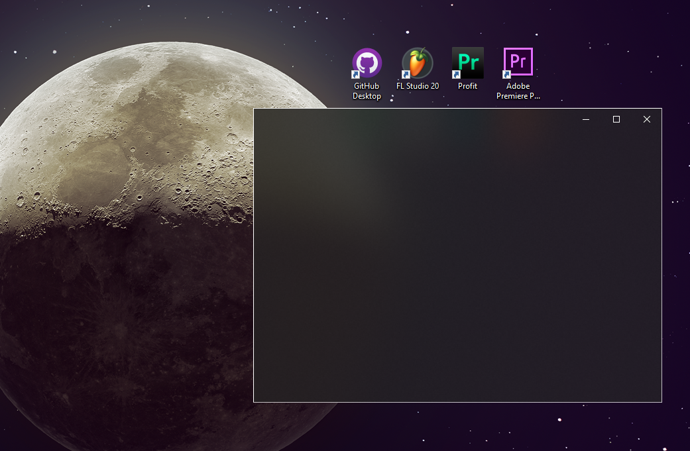
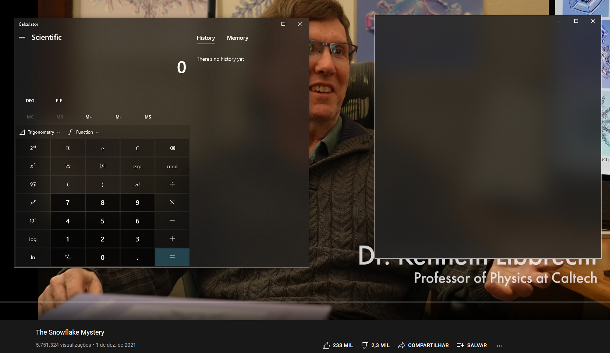

# Acrylic Components
This is a set of Delphi components adapted to use Window's Acrylic material.  

The TAcrylicForm comes totally blank, with redrawn minimize/maximize/close buttons. 
It's resizable by default, and you can change properties like:
- Color 
- BlurAmount
- Resizable

# Demos

Here's how it looks

  

It uses the same API used by multiple menus in Windows 10.

  

# Components 

1. TAcrylicButton     : A simple button with a removable background and border and hovered effects. 
2. TAcrylicFrame      : A type of window that can be used within TAcrylicForm. 
3. TAcrylicGhostPanel : A panel equivalent to TPanel but with Ghost property (which allows to ignore mouse messages) and own painting method. 
4. TAcrylicKnob       : A simple rotatory slider that can be changed by dragging the mouse or using the wheel.
5. TAcrylicTrackBar   : A horizontal slider that can be changed by dragging the mouse or using the wheel.  

Among others.

# Observations

- It is highly recommended add both *src* and *deps/gr32* folders to the Delphi's browsing path.
- Acrylic effect works properly both in Windows 10 and Windows 11.
- This set of controls can be used in windows 7 as well, but the acrylic/blur effect is turned off. In this occasion, every component will have its background painted with the color assigned to the BackColor property. 